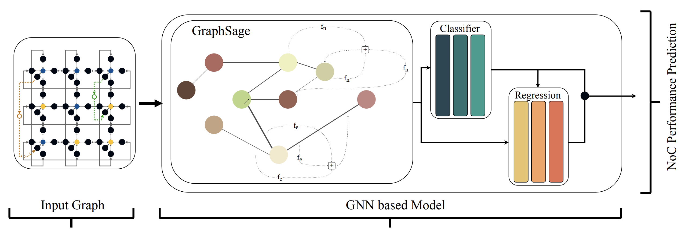

# GraphNoC: Graph Neural Networks for Application-Specific FPGA NoC Performance Prediction



>  *Gurshaant Malik and Nachiket Kapre*

>    <b>Full Paper</b>: ["GraphNoC: Graph Neural Networks for Application-Specific FPGA NoC Performance Prediction"](https://nachiket.github.io/publications/graph-noc_fpt-2024.pdf)

>    <b>International Conference on Field-Programmable Technologies, Dec 2024 </b>

>    <b>Best Paper Award</b>: [Certificate](https://nachiket.github.io/images/fpt2024_award.pdf)

>    <b>Presentation Link </b>: [Video](https://www.youtube.com/watch?v=5QCAJI3EI-Q)

## Overview

- We can democratize the design of FPGA networks-on-chip by replacing slow and expensive conventional NoC benchmarking tools with highly accurate and fast graph-neural-network models.
- FPGA reconfigurability allows for tuning and designing of NoCs specific to the application being implemented on the FPGA, a facility not afforded to ASIC NoCs.
- However, such application-specific NoC designs can require thousands of incremental updates and customization to the NoC design, with each resulting NoC configuration needing benchmarking for packet performance to guide the design process.
- Additionally, each of these benchmark runs can take up to minutes with conventional tools like RTL simulation for modest packet trace lengths.
- As a result, tuning and design of a NoC even for a single FPGA application can last up to days, presenting a critical bottleneck to developer efficiency and iteration speed.
- We address this by: 
    - Presenting a framework to encode any FPGA NoC and any FPGA application traffic into graphs, called GraphNoC.
    - We create a dataset of these graphs, comprising of different FPGA NoCs and applications.
    - We use this dataset to train GNNs, including foundation models, to predict NoC routing latencies that can accelerate benchmarking run-times by up to 148× (506× using GPU) with prediction top-20 accuracies up to 97.2%.
    - We also show these GNNs can accelerate end-to-end FPGA application-specific NoC design by up to 4.3× (37× using GPU) while regressing final NoC latency by only 30 cycles.

## Installation

Create a Python environment and install the runtime dependencies:

```bash
python3 -m venv .venv
source .venv/bin/activate
python3 -m pip install -r requirements.txt
```

## Dataset

- The paper datasets are published as assets in the [`paper-datasets`](https://github.com/watcag/graphnoc/releases/tag/paper-datasets) release. Download the ZIP files into a local `datasets/` directory before running the experiments.
- The datasets are organized as follows:
   - The dataset is split into three categories: training, validation, and test. The validation set is held out during training for hyperparameter selection; the test set is used to report accuracy.
- Each file is named `{type}_{size}.zip`, where `type` is `train`, `val`, or `test`, and `size` determines the NoC size.
- Select one or more NoC sizes with the Python scripts' `--N` argument. The training framework chooses the appropriate dataset split automatically.
- [data.py](data.py) constructs the datasets. Creating new datasets also requires the repositories that generate NoC ground-truth data.

## Models
- As shared in the paper, we have trained 3 GNN models of different sizes:
    1. Small: Num of layers 20 and embedding size of 64.
    2. Medium: Num of layers 15 and embedding size of 128.
    3. Large: Num of layers 10 and embedding size of 256.

- This is controlled in the python script using `--num_layers` and `--emb_size` args.
- If you use the layer count and embedding size corresponding to the models above, you can load the supplied trained models with the Python scripts' `--model_load_path` argument.
- All models trained and used in the paper are available at [saved_models](./saved_models) folder.
- Model architectures are in [models.py](models.py).

## Main API and Arguments
- For training and evaluating accuracy of models, and emulating experiment A of the paper, use [train.py](train.py).
- To test switch discovery using a GNN and reproduce Experiment C, use [test_discover_switches.py](test_discover_switches.py). Comparing against the Hoplite analytical framework also requires the [Hoplite-ML repository](https://github.com/watcag/hoplite-ml).
- To test GNN inference speed and reproduce Experiment B, use [test_speed.py](test_speed.py). Comparing against the Hoplite analytical framework also requires the [Hoplite-ML repository](https://github.com/watcag/hoplite-ml).
- All paper results are stored in CSV files [sweep_speed.csv](sweep_speed.csv) [sweep_discover_switches.csv](sweep_discover_switches.csv).
- Some of the main arguments for these python scripts are as follows:

```
        "--N",
        type=int,
        nargs="+",
        required=True,
        help="""Sizes of the NoC for which to run the program. Space delimited
        for multiple options. Example `--N 4 8 16` for specifying sizes of 4, 8
        and 16""",
```


```
        "--model_load_path",
        type=str,
        required=False,
        help="""If a model checkpoint will be loaded. Program will use this model
        to run.""",
``` 

```
        "--model_save_dir",
        type=str,
        required=False,
        default=f"{os.getcwd()}/models/{time.time()}",
        help="""Directory in which best validating models will be saved. Models will
        be saved as model_{loss}.pt in this directory. If not specified, the directory will
        be a timestamped directory of the nature models/`timestamp` in CWD""",
```

```
        "--num_layers",
        type=int,
        required=False,
        default=5,
        help="The numbers of layers to use in the model",
```

```
        "--emb_size",
        type=int,
        required=False,
        default=128,
        help="Size of the model's nodes' activations.",
```

```
        "--dropout",
        type=float,
        required=False,
        default=0.2,
        help="""Dropout to apply on the model when training. Must be between
        0 and 1""",
```
   
```
        "--batch_size", type=int, required=False, default=128, help="Batch size of data."
```

```
        "--lr",
        type=float,
        required=False,
        default=0.000001,
        help="""Learning rate of the training. Applicable only if actually training
        the model""",
```

```
        "--dataset_folder",
        type=str,
        required=True,
        help="Path from which the datasets will be loaded.",
```

   
```
        "--eval_model",
        action='store_true',
        help="""Model is only evaluated on validation and test sets,
        if set. Otherwise model is trained on the train set and
        evaluated on validation and test sets.""",
```

```
        "--epochs",
        type=int,
        required=False,
        default=100000,
        help="Number of epochs to train the model for.",
```


# Scratch -- Ignore


the following results are with the saved model for "hml_all_sizes" which was trained with following args:
large:`python train.py --N 3 4 5 6 7 --model_type graph_sage_class_reg --dataset_folder /home/gsmalik/work/common_noc/datasets --limit 1000 --num_layers 10 --emb_size 256 --batch_size 64 --lr 0.0000005`
medium:`python train.py --N 3 4 5 6 7 --model_type graph_sage_class_reg --dataset_folder /home/gsmalik/work/common_noc/datasets --limit 1000 --num_layers 15 --emb_size 128 --batch_size 64 --lr 0.0000005`

eval_gnn (large size),  gpu

        1   |  2  |  4  |  8   |  16  |  32  |  64  | 128
        -------------------------------------------------
N=3     143 | 281 | 545 | TODO | 2200 | 4250 | 8040 | 9150 
N=4     141 | 278 | 555 | TODO | 2150 | 4130 | 5190 | 5160
N=5     141 | 274 | 548 | TODO | 2120 | 3380 | 3330 | 3070
N=6     139 | 274 | 553 | TODO | 2060 | 2380 | 2190 | 1900
N=7     138 | 270 | 539 | TODO | 1710 | 1690 | 1570 | 1360

eval_gnn (large size),  cpu

        1   |  2  |  4  |  8   |  16  |  32  |  64  | 128
        -------------------------------------------------
N=3     148 | 249 | 398 | TODO  | 770  | 910  | 838  | 988
N=4     128 | 182 | 325 | TODO  | 478  | 592  | 525  | 480      
N=5     114 | 168 | 249 | TODO  | 341  | 353  | 319  | 282
N=6     103 | 108 | 188 | TODO  | 248  | 237  | 209  | 182
N=7     87  | 129 | 123 | TODO  | 180  | 163  | 141  | 130

eval_gnn (medium size),  gpu

        1   |  2  |  4  |  8   |  16  |  32  |  64  | 128
        -------------------------------------------------
N=3     96  | 191 | 382 | 757  | 1530 | 2970 | 5910 | 11600 | TODO 
N=4     96  | 195 | 385 | 762  | 1500 | 2960 | 5900 | 8030  | TODO
N=5     95  | 192 | 380 | 758  | 1500 | 2950 | 5180 | 5150  | TODO
N=6     97  | 192 | 378 | 750  | 1490 | 2890 | 3760 | 3350  | TODO
N=7     97  | 191 | 380 | 750  | 1460 | 2750 | 2620 | 2280  | TODO

eval_gnn (medium size),  cpu

        1   |  2  |  4  |  8   |  16  |  32  |  64  | 128
        -------------------------------------------------
N=3     136 | 244 | 396 | 438  | 601  | 1230 | 1230 | 1650 | TODO 
N=4     123 | 204 | 343 | 459  | 696  | 844  | 1060 | 877  | TODO      
N=5     107 | 174 | 189 | 414  | 531  | 565  | 545  | 513  | TODO      
N=6     98  | 107 | 150 | 203  | 374  | 402  | 363  | 336  | TODO      
N=7     63  | 92  | 222 | 168  | 299  | 284  | 259  | 226  | TODO      


eval_qor,  cpu

        1   |  2  |  4  |  8   |  16  |  32  |  64  | 128
        -------------------------------------------------
N=3     88  | 131 | 175 | 210  | 232  | 245  | 253  | 256 
N=4     89  | 134 | 180 | 216  | 239  | 253  | 260  | 263 
N=5     89  | 133 | 179 | 216  | 240  | 254  | 261  | 263
N=6     89  | 133 | 179 | 218  | 241  | 256  | 264  | 266
N=7     86  | 130 | 177 | 216  | 241  | 255  | 264  | 263
